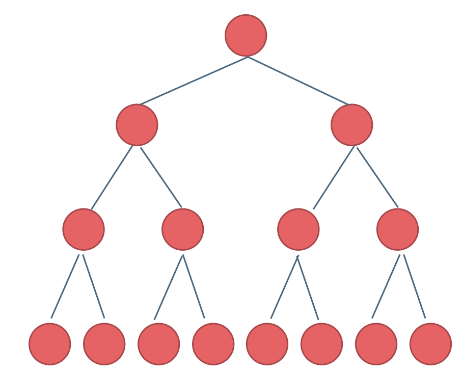
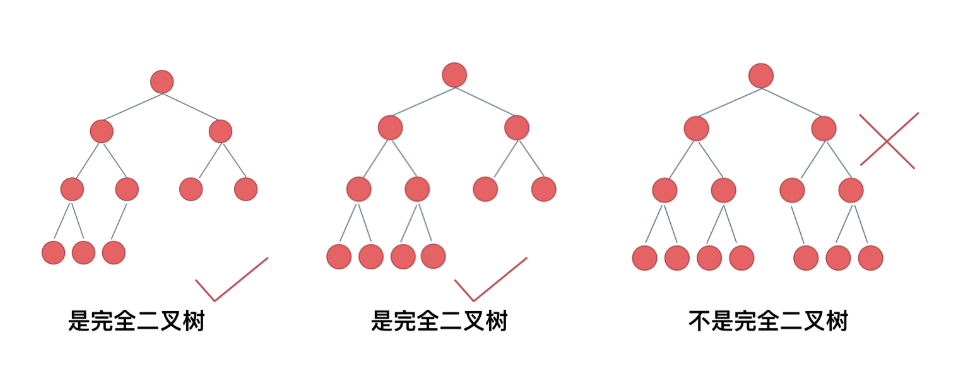
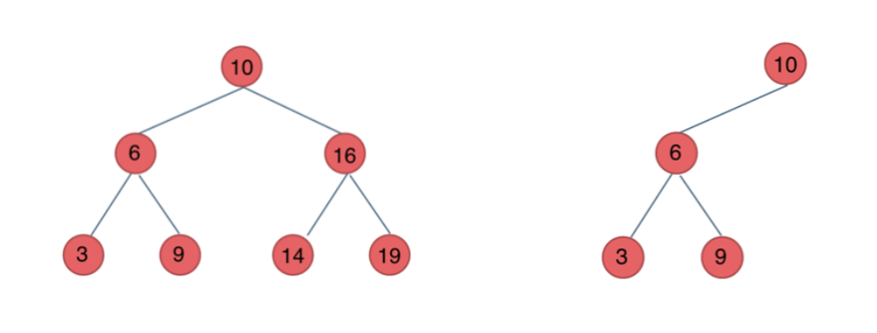
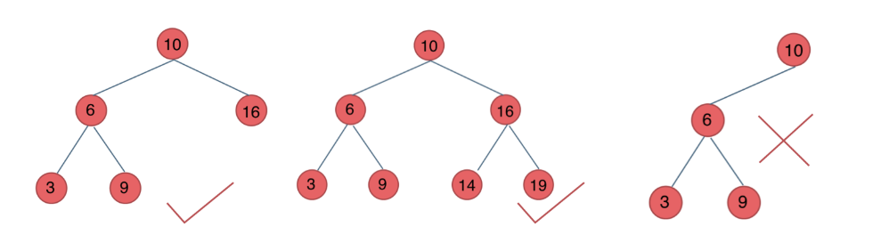
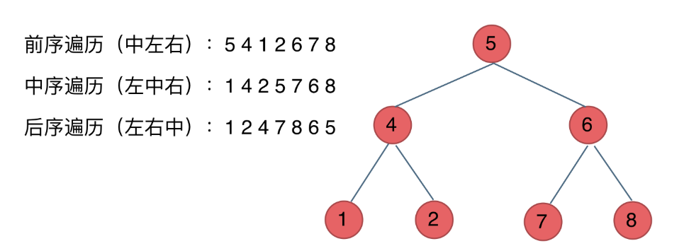

# 基础理论

是一种树形结构，每个节点最多 2 个子节点，称为左子节点和右子节点

- 节点（Node）：每个元素都称为一个节点，包含数据以及指向左右子节点的引用
- 根节点（Root）：树的最顶层节点，没有父节点
- 父节点（Parent）：一个节点的直接上级节点
- 子节点（Child）：一个节点的直接下级节点，分为左子节点和右子节点
- 叶子节点（Leaf Node）：没有子节点的节点
- 深度（Deep）：一个节点到根节点的路径长度（经过的边数）
- 高度（Height）：从某一节点到其最远叶子节点的路径长度

## 二叉树的分类

### 满二叉树

- 除了叶子节点外，每个节点都有两个子节点
- 节点数是 2^k - 1, k 为树的高度
  

### 完全二叉树

- 除了最后一层外，其他每层节点数都达到最大，并且最后一层的节点尽可能地集中在左边。
  

### 二叉搜索数

- 一种有序的二叉树，左子树上的所有节点值小于父节点，右子树上的所有节点值大于父节点。
  

### 平衡二叉树

- 每个节点的左右子树的高度最多为 1
  

## 二叉树的遍历方法

- 深度优先遍历：先往深走，遇到叶子节点再往回走。
  - 前序遍历: 中左右
  - 中序遍历: 左中右
  - 后续遍历: 左右中
- 广度优先遍历
  - 层次遍历（通常用队列）

