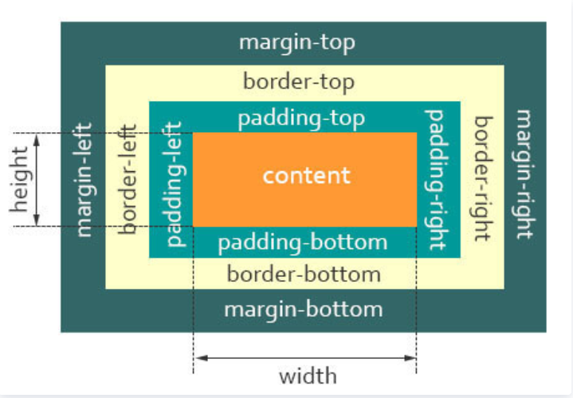
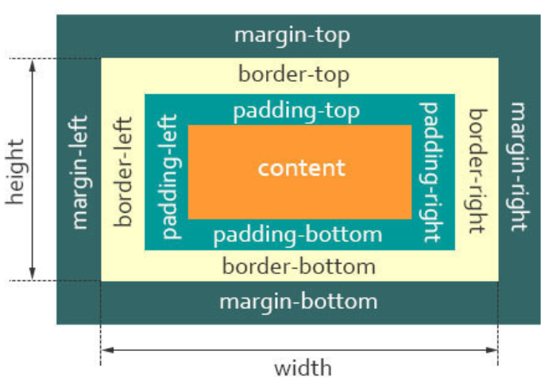

# 盒子模型
## 什么是盒子模型？
- 当对一个文档进行布局的时候，浏览器的渲染引擎会根据标准之一的**CSS基础框盒模型**，将所有元素表示为一个个矩形的盒子
- 一个盒子模型由四部分组成
  - content：实际内容
  - padding：内边距
  - margin： 外边距
  - border： 边框



## 盒子模型有哪些？
### 标准盒模型
默认浏览器默认的盒模型是标准盒模型

- 总宽度 = width + padding + border + margin
- 总高度 = height + padding + border + margin

### IE怪异盒模型

- 总宽度 = width + margin
- 总高度 = height + margin
也就是说，``width/height``包含了``padding``和``border``的值

## Box-sizing
```js
box-sizing: content-box|border-box|inherit:
```
- content-box：默认值，标准盒模型
- border-box： 怪异盒模型
- inherit：    从父元素继承