# Git

## 前置知识

### 什么是 Git?

Git 是一个**分布式版本控制**工具，可以帮助开发人员进行代码的追踪、维护、控制等一系列操作。

- 不同版本的存储管理
- 重大版本的备份维护
- 恢复之前的项目版本
- 记录项目的点点滴滴
- 多人开发的代码合并

#### 分布式和集中式有什么区别？

- 分布式：每个开发者都有一份完整的代码仓库，包括所有的提交历史，开发者可以在本地提交、查看历史记录、甚至创建分支，不需要链接中央服务器。
  - 即使服务器崩溃，每个开发者的本地仓库都有完整的代码历史，能够恢复数据
- 集中式：只有一个中央服务器，所有的版本信息都存储在这个服务器上，开发者需要从服务器拉取代码并提交代码到服务器。（必须联网才能提交、查看历史记录、切换版本等操作）
  - 服务器如果宕机，所有开发者都无法提交代码，甚至可能会丢失代码

### 基本概念

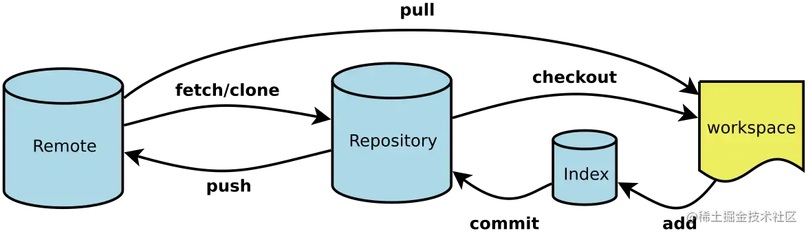

- 初始化版本库

  - git init：改命令将创建一个名为`.git`的子目录，包含你初始化的`Git`仓库中所有的必须文件，并且会自动创建`master`分支。
  - git clone 远程仓库地址：将从`Git`远程仓库拉取文件

- 工作区

  - 本地项目存放文件的位置

- 暂存区

  - 当我们使用`git add`命令时，将工作区的文件添加到了暂存区

- 本地仓库

  - `git commit`命令时，可以将暂存区的文件添加到本地仓库

- 远程仓库
  - 目前我们的代码只存放在本地，如果我们用`GitHub`托管我们项目时，它就是我们的远程仓库

### 文件状态

- 未跟踪：默认情况下，`Git`仓库下的文件也没有添加到`Git`仓库管理中，我们需要通过`add`命令来操作；像`.gitignore`文件中就可以写入不被`git`跟踪的文件
- 已跟踪：添加到`Git`仓库管理的文件处于已跟踪状态，`Git`可以对其进行各种跟踪管理
  - `staged`：暂存区中的文件状态
  - `Unmodified`：`commit`命令，可以将`staged`中文件提交到`Git`仓库
  - `Modified`：修改了某个文件后，会处于`Modified`状态

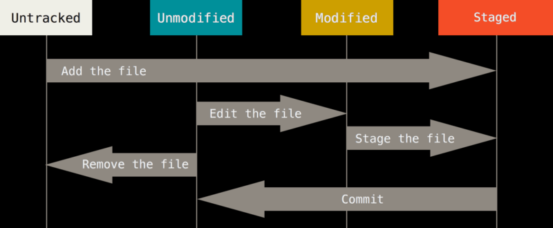

### 远程仓库

- 我们现在的代码都是保存在本地仓库中，意味着我们只是在进行本地操作。
- 在多人开发时，我们需要将我们的代码共享到远程仓库中，这样别人就可以获取到你所写的代码内容
- 第三方的`Git`服务器：`GitBHub`、`Gitee`、`Gitlab`等等
  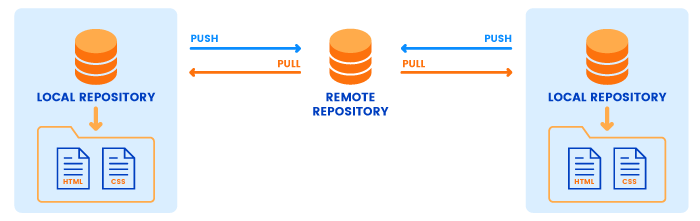

#### 关联远程仓库

- 当我们使用`git push`时，会提醒我还未与远程仓库建立链接
  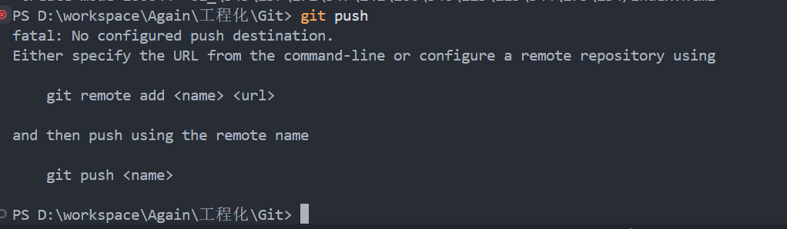
- 命令
  - `git remote add origin https://github.com/free-booter/Git-.git`（添加远程仓库地址名为 origin）
  - `git push -u origin master`（将`master`分支推送到远程仓库`origin`，并设置默认上游分支[以后可以直接 git push 或 git pull]）
    

查看更加详细的点击：https://liaoxuefeng.com/books/git/introduction/index.html

### 什么是分支？

- 当我们开发项目时，为了不影响主代码的情况下进行开发、测试或尝试新功能，我们将会建议属于自己的分支，在自己的分支进行开发等操作。

#### 分支命令

- 创建分支：
  `git branch xxx`
- 切换分支：
  `git checkout xxx`
- 创建并切换分支
  `git checkout -b xxx`
- 合并分支：
  `git merge xxx`
- 查看所有分支：
  `git branch`
- 查看分支最后一次提交
  `git branch -v`
- 查看所有合并到当前分支的分支
  `git branch --merged`
- 删除分支
  `git branch -d xxx`
- 恢复本地分支
  - `git reflog`找到该分支最近的操作记录，然后使用`git checkout -b feature/grid 117ff20`进行恢复
    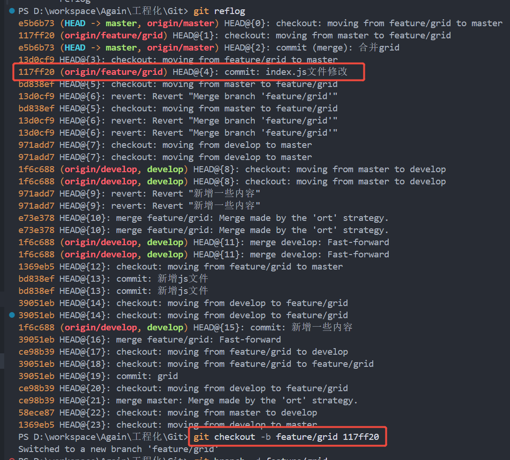

## 命令

### 冲突

- 当我从 master 分支拉了 develop 分支
- 在 master 分支中我添加了新内容，并更新到了远程
- 在 develop 分支中，修改的同一个文件，提交并合并 master 分支时，会产生冲突
  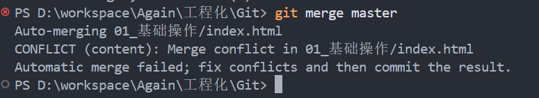
  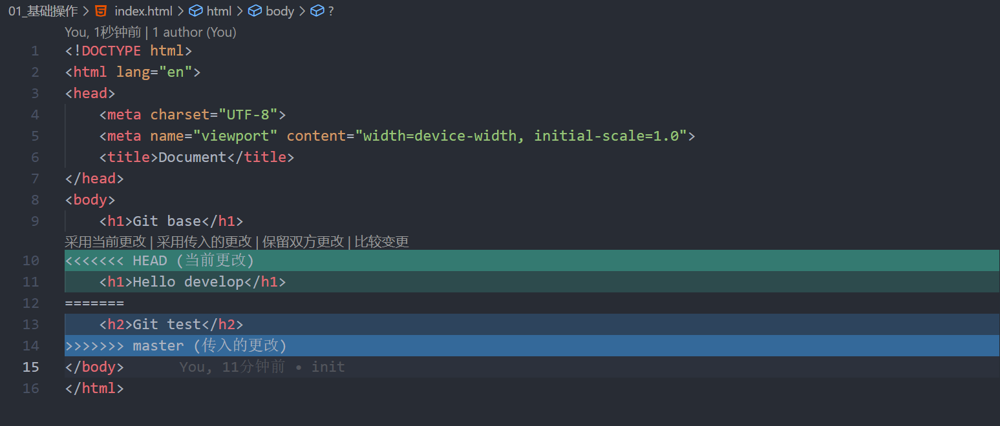
- 解决冲突：
  - 选择自己想要的内容后，`git add .`、`git commit -m 'xxx'`、`git push`

### cherry-pick

> 此次提交的内容想要在别的分支也保留

假设场景为`develop`上的一次提交需要合并到`master`分支上

- `git log`：在`develop`查看分支的提交内容
  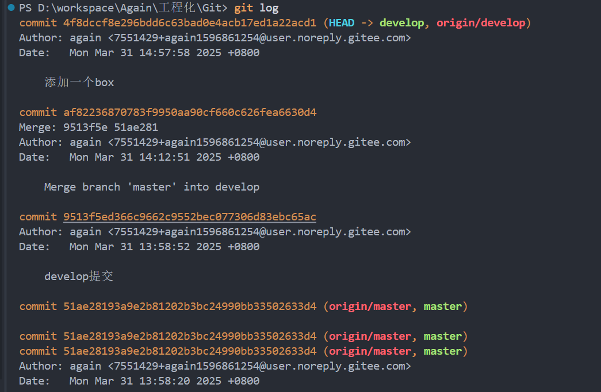

- `git cherry-pick xxx`
  - 切换到`master`后执行 `git cherry-pick [需要复制的提交编码]`
    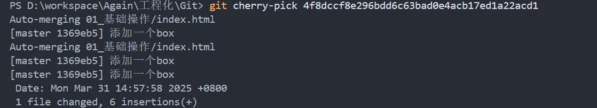
- `gits cherry-pick --abort`
  - 放弃`cherry-pick`
- `git cherry-pick --quit`
  - 回退`cherry-pick`
- `git cherry-pick commit1 commit2`
  - 复制多个
- `git cherry-pick commit1^..commit2`
  - 复制`commit1`到`commit2`的区间（包含）

### revert

> 假设 master 分支中，有一个人开发的内容是错误的或者说是多余的，可以使用此命令祛除他的 commit 内容

- 我在`develop`分支新增了一些内容，并且已经将`develop`分支的内容合并到了远程的`master`，但是现在`master`分支并不想要框起来的内容
  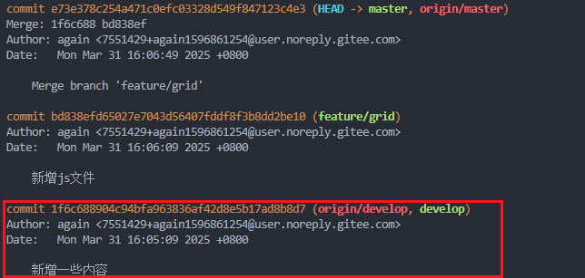
- `git revert 1f6c688904c94bfa963836af42d8e5b17ad8b8d7`：使用改命令后，该部分内容从`master`祛除了
  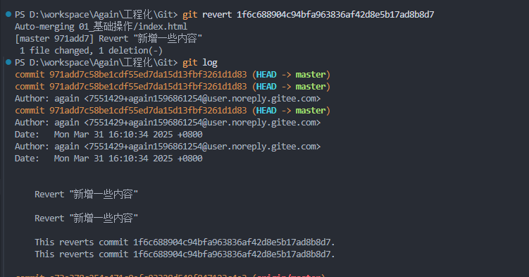

- 祛除合并分支的内容
  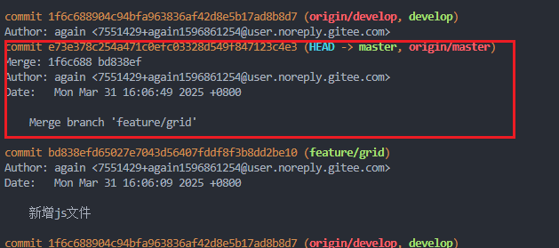
  - `git revert -m 1 e73e378c254a471c0efc03328d549f847123c4e3`
    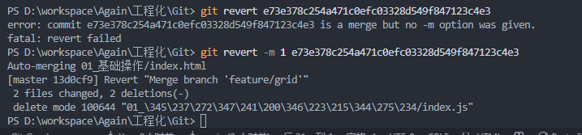

https://juejin.cn/post/7071780876501123085?searchId=20250331102715E48C7AED89F4FC6BE6E3#heading-11

### git fetch 和 git pull 的区别

- `git fetch`：如果`origin/develop`分支内容已经被修改，而本地的`develop`分支代码并不是最新的，此时并不想直接合并`origin/develop`，可以通过`git fetch`命令去查看哪些地方没更新了，如果想要去合并可以使用`git merge origin/develop`或者`git pull`
- `git pull`：拉取`origin/develop`分支最新代码并合并到本地`develop`分支
