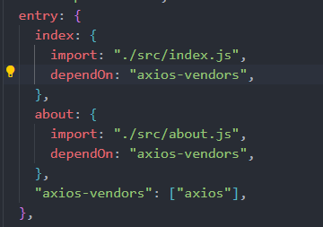

# Webpack

## 前置知识

### 什么是 webpack？

是一个静态模块打包工具，它会在内部从一个或多个入口点构建成一个依赖图，然后将项目中所需要的每一个模块组合成一个或多个 bundles(静态资源)

### webpack 的安装

- 全局安装
  - `npm install webpack webpack-cli -g`
- 局部安装
  - `npm install webpack webpack-cli -D`
- 建议局部安装：每个项目的 webpack 版本是不一样的

#### webpack 和 webpack-cli 的关系

- 当我们在终端使用`webpack`命令时，需要用到 webpack-cli 来帮我们去执行命令，执行命令需要用到`webpack`去生成依赖图来进行打包

### 打包命令

- 更改打包输出的文件名
  - `npx webpack --output-filename xx.xx`
- 更改打包输出的文件夹名
  - `npx webpack --output-path ./xx`
- 更改打包入口
  - `npx webpack --entry xx.xx`

### webpack 配置文件

### 当我们执行`npm run build`时，发生了什么？

- 它会先去你的`package.json`文件中的`scripts`查找名为`build`的脚本。
- 假设你的命令是：`build: webpack --development --open`，`npm` 会从`node_modules/.bin`目录下找到`webpack`可执行文件并运行。
- 运行的命令本质上是：`node_modules/.bin/webpack --development --open`，它会执行`webpack`打包命令，将环境设置为`开发`并打开浏览器。
- 如果没有全局安装 `webpack`，`npm` 会优先使用项目本地安装的 `webpack`。

### Loader

#### 什么是 loader？

- `webpack`默认只能理解`JS`和`JSON`文件，无法理解其他类型的文件（如 `CSS`、`Vue`、`Scss` 等）。
- 如果需要处理这些文件，就需要使用 `loader`，它是一个模块转换器，用于在打包前对文件进行预处理。
- 每种文件类型通常对应一个或多个 `loader`，例如：
  - 处理 `CSS` 文件：`css-loader` 和 `style-loader`
  - 处理 `Sass/Scss` 文件：`sass-loader`
  - 处理 `Vue` 文件：`vue-loader`
  - 处理图片等资源文件：`file-loader` 或 `url-loader`（`webpack5`可以内置处理图片，不需要添加`loader`）

### plugin

#### 什么是插件？

- `插件`目的在于解决`loader`无法实现的其他事，例如：打包优化、资源管理、环境变量注入等；
- `CleanWebpackPlugin`：每次重新打包，都需要手动删除打包文件，这个插件可以自动帮我们删除打包文件
- `HtmlWebpackPlugin`：可以帮我们在打包文件下生成一个更规范的`index.html`文件
- `DefinePlugin`：允许在编译时创建配置的全局常量，是内置插件

## sourcemap

### 为什么需要开启 sourcemap?

- 浏览器无法识别`ts`、`Vue`、`React`代码，我们需要将其打包压缩为浏览器可以识别的代码
- 打包压缩：
  - 将代码进行丑化压缩时，会将编码名称等修改
  - `ES6`代码可能被转成`ES5`
  - 对应的代码行号、列号在经过编译后不一致
- 当代码报错需要`调式时`，调式`转换后的代码`是很困难的。
  

**`source-map`从已转换的代码，映射到源代码**

## babel

### babel 是什么？

- `babel`是一个`JavaScript`编译器，可以将`ES6+`的代码转换为`ES5`浏览器可以运行的代码。

#### 使用

- 安装`babel-loader`和 `@babel/preset-env`
- `babel-loader`负责让`webpack`调用`babel`
- `@babel/preset-env`：`webpack`会根据我们的预设来加载对应的插件列表，并且将其传递给`babel`
- `webpack.config.js`配置：
  
- `babel.config.js`配置：
  

### browserslist

### polyfill

### 编译 react 和 ts 代码

## webpack 优化手段

### 代码分割

#### 入口起点

- 配置多个`entry`，每个入口都会生成一个`bundle`文件
- 优点：
  - **适合多页面应用(MPA)**，不同页面有独立的`JS逻辑`，互不依赖的场景
  - **优化首屏加载时间**：只需要引入所需要的`bundle`文件即可
  - **独立缓存机制**：如果某个页面的代码更新了，不会影响其他页面的缓存
    - 疑问：如果更改了某个页面打包重新打包后，bundle 文件是否会同步更改文件名？如果同步更改了文件名，那意味着是一个新的文件了，那浏览器不是会重新获取资源吗？
    - 三种生成`hash`机制区别：
      - `hash`：整个项目的构建 hash，只要项目中任意一个文件变动，所有文件的 hash 都会变。
        - 一人感冒，全公司打吊瓶
      - `chunkhash`：根据每个 entry chunk 生成 hash。只有 chunk 内容变了，才会变化。（是根据每个 chunk 的依赖和内容生成的 hash。）
        - 小组内感冒，小组打吊瓶，其他小组无感
      - `contenthash`：根据文件内容生成 hash。只有具体文件内容变了，hash 才变，最精细的粒度。（是根据单独文件内容生成的 hash（比如用于 JS、CSS 文件时最好用它）。
        - 谁感冒谁打，别人不动
    - **使用`chunkhash`或者`contenthash`**

```js
 entry: {
    index:"./src/index.js",
    main:{
        import:"./src/main.js",
    },
  },
  output: {
    path: path.resolve(__dirname, 'dist'),
    filename: '[name]_[contenthash:8].js',
    clean: true
  },
```



#### 防止重复

#### 动态导入
