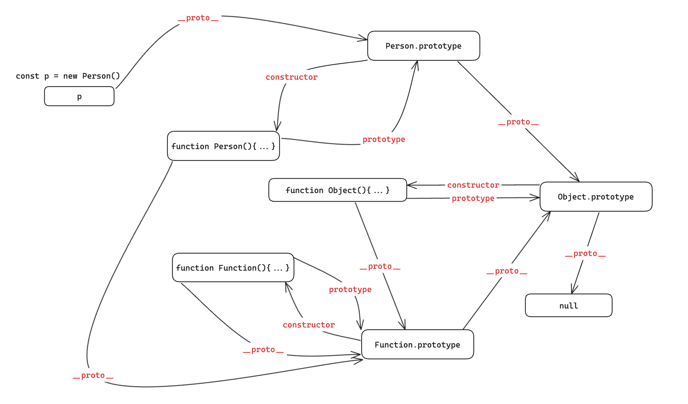
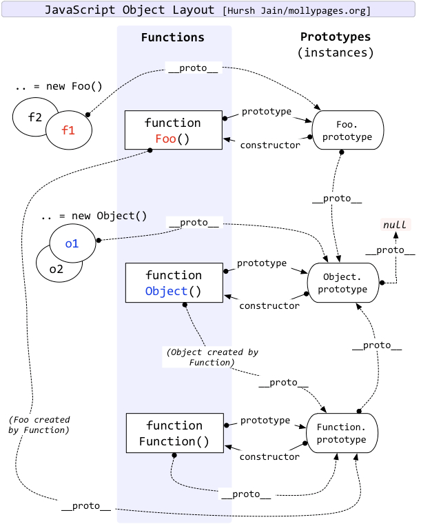

# 原型
## 前置知识
- ``__proto__``和``constructor``是对象独有的属性
- ``prototype``是函数独有的属性
- ``constructor``指向函数本身
- 因为函数也是对象，所以函数也有``__proto__``和``constructor``属性

## 显示原型
- 每个函数都有一个``prototype``属性，它默认指向一个``Object``空的实例对象(原型对象)
- 原型对象中有一个``constructor``属性，指向函数本身
- 函数的所有实例对象自动拥有原型中的属性

## 隐示原型
- 每个实例对象都有一个``__proto__``属性，指向构造函数的原型对象

## 原型链
```js
class Person{
    constructor(name, age){
        this.name = name;
        this.age = age;
    }
    say(){
        console.log(`name: ${this.name}, age: ${this.age}`);
    }
}

const p = new Person('Tom', 23)
```

- ``p``是``Person``的实例对象，``p``可以通过``__proto__``属性访问到``Person.prototype``对象
- ``Person.prototype``对象中有一个``constructor``属性，指向``Person``函数本身
- ``Person.prototype``对象中有一个``__proto__``属性，指向``Object.prototype``对象
- ``Object.prototype``对象中有一个``__proto__``属性，指向``null``
- 当我们访问``p``中的属性时，它会先从自身开始找，如果自身没有，则会通过``__proto__``属性找到``Person.prototype``对象，然后再通过``__proto__``属性找到``Object.prototype``对象，最后再通过``__proto__``属性找到``null``，如果还没有找到，则返回``undefined``

