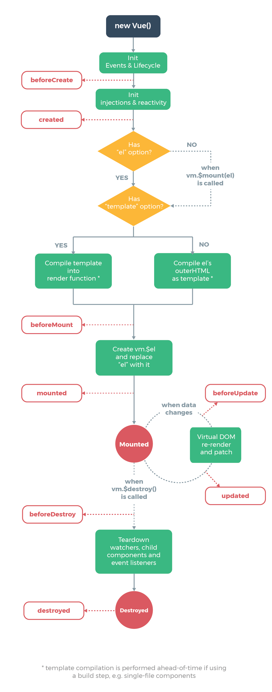

# 生命周期
## 生命周期是什么？
- 从软件工程的角度来说，生命周期是指软件从构建到运行再到销毁的整个过程。
- 在``Vue``中，生命周期是指一个组件从创建到销毁的整个过程。
## Vue的生命周期
> 分为8个阶段，创建前后、挂载前后、更新前后、销毁前后。

| 阶段 | 钩子函数 | 说明 |
| --- | --- | --- |
| 创建前 | beforeCreate | 实例初始化之后，数据观测和事件配置之前被调用 |
| 创建后 | created | 实例创建完成后被调用，此时实例已完成数据观测和事件配置 |
| 挂载前 | beforeMount | 挂载开始之前被调用：相关的 `render` 函数首次被调用 |
| 挂载后 | mounted | 挂载完成后被调用：实例已经挂载到 `DOM` 上 |
| 更新前 | beforeUpdate | 数据更新时调用，发生在虚拟 `DOM` 重新渲染和打补丁之前 |
| 更新后 | updated | 由于数据更改导致的虚拟 `DOM` 重新渲染和打补丁之后被调用 |
| 销毁前 | beforeDestroy | 实例销毁之前调用。在这一步，实例仍然完全可用 |
| 销毁后 | destroyed | 实例销毁之后调用。调用后，所有的事件监听器和子实例被移除 |
| 激活时 | activated | `keep-alive` 组件激活时调用 |
| 停用时 | deactivated | `keep-alive` 组件停用时调用 |
| errorCaptured | errorCaptured | 当捕获一个来自子孙组件的错误时被调用 |

## 在created和mounted中分别调用接口有什么区别？
``created``是在组件实例一旦创建完成的时候立刻调用，这时候页面``DOM``节点并未生成；``mounted``是在组件挂载到``DOM``节点后调用，这时候页面``DOM``节点已经生成。
- 如果需要进行一些``DOM``操作的话，应该在``mounted``中进行。